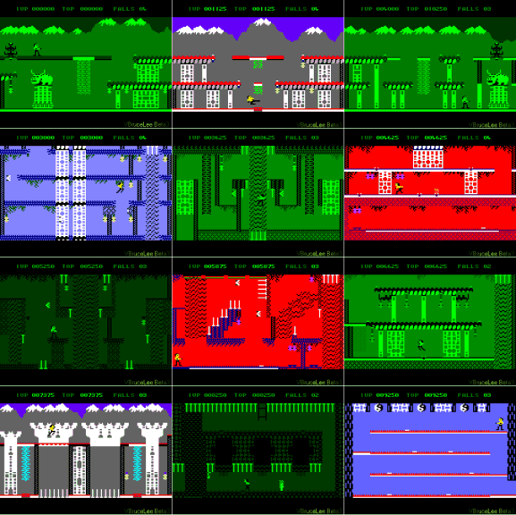



## VBBruceLee \(Beta version\) \*Updated Color & VB5\.0 Compatibility\*

### Description

VBBruceLee its a remake of a classical U.S. Gold 1984 CPC 464 game (See the screenshot). The 80 % of the game its completed, but enemy AI and other stuff still needs to be implemented. The original U.S. Gold game have 19 screen (plus finish screen) In this beta there are 18 of this 19 screens. The code uses DX7 only for fullscreen initialization and playing some wav files, all the rest its done using Win32 API. Original, the code was for myself, for this reason there isn't much coments (if u want 1 line of code and 20 lines with comments, buy a book, or read a very very nOob pre-beginner tutorial. :)

I programed this game under AMD K6-2 at 350 Mhz, but runs fine on PII 233 Mhz (tested under Win98 with S3 4Mb video card, with DirectX 8)

You can do with this piece of code what you want, only one thing: Don't change Lives variable to set more than 99 lives...hahaha! (its a joke, of course).

I you like this, please vote, and i you don't like this, well, report why not!

Enjoy.

*UPDATED* I'm just Updated VBBruceLee with option to play with colors (See new screen shot)

*UPDATED* Now, the game its compatible with VB5.0 (Split Modification changed. May be it's compatible with VB4.0 too)
 
### More Info
 

             |
---                |---
**Submitted On**   |2004-03-17 01:02:02
**By**             |[John Ripper](https://github.com/Planet-Source-Code/PSCIndex/blob/master/ByAuthor/john-ripper.md)
**Level**          |Beginner
**User Rating**    |4.9 (79 globes from 16 users)
**Compatibility**  |VB 5\.0, VB 6\.0
**Category**       |[Games](https://github.com/Planet-Source-Code/PSCIndex/blob/master/ByCategory/games__1-38.md)
**World**          |[Visual Basic](https://github.com/Planet-Source-Code/PSCIndex/blob/master/ByWorld/visual-basic.md)
**Archive File**   |[VBBruceLee1721093172004\.zip](https://github.com/Planet-Source-Code/john-ripper-vbbrucelee-beta-version-updated-color-vb5-0-compatibility__1-52401/archive/master.zip)

